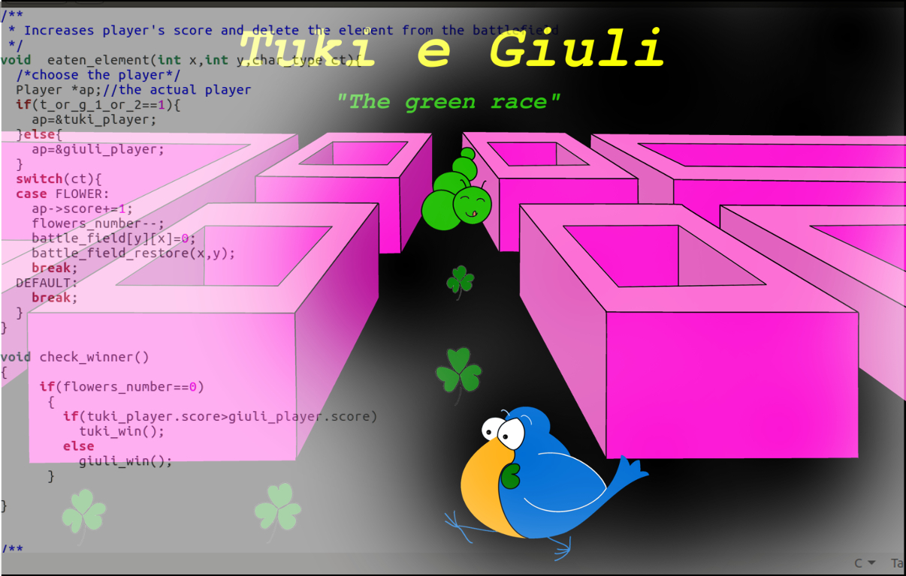

# The-green-race
A terminal based coding game in C language. 
## Stable version
Stable and ready to play version of this game, can be downloaded [here](http://www.isisinipazzi.it/tuki/tuki1.html)
## Description
In this game a caterpillar (Giuli) and a toucan (Tuki) challenge each other to eat the most clovers. The clovers are in the grass along a labyrinth of which Giuli and Tuki do not know the map. The two players have to write an algorithm to guide their character (Giuli or Tuki) in this race trying to eat more of the opponent's clovers
## Installing
No installation is required.
## How to play
You can start playing by challenging the algorithm written by Scuola_Sisini, in this case the game consists of writing your sorting algorithm in tuki_turn.c, compiling it with the rest of the program by typing "make" at the prompt, and then watching what happens when you run the executable `tuki`.
In steps:	
	- Take a look at the file `player.h`.
	- Create an algorithm to explore the labyrith.  
	- Implement `tuki_turn()` function with your algorithm, of course you need to use the functions defined
	in player.h here.
	- Compile the executable by typing `make` at the prompt. If there are no errors in your code the 	   	compilation should produce an executable file named `tuki`.  
	- Run `tuki` by typing `./tuki -p`
## Watch a demo
If you want to watch demo of a race with Tuki's algorithm implemented  run `tuki_demo` as follows:
```C
	- sudo chmod +x tuki_demo
	- ./tuki_demo
```
-----
You can challenge another programmer by writing your code and compiling it in the object file `giuli_turn.o`
	
## Requirements
The game is known to compile on Linux with ncurses 5.2 installed. If not,  install it by typing:
`sudo apt-get install libncurses5-dev libncursesw5-dev`
at the prompt command (terminal).
## Control keys
This version fo the game can not be played interactively. 
## Commands 
Type `./tuki -p` to play the game.
Type just `./tuki` to see  more options.
## Licensing
Tuki is protected under the laws of the GPL and other countries. Any redistribution, reselling or copying is strictly allowed. You should have received a copy of it with this package, if not, write to the Free Software Foundation, Inc., 59 Temple Place, Suite 330, Boston, MA  02111-1307  USA

